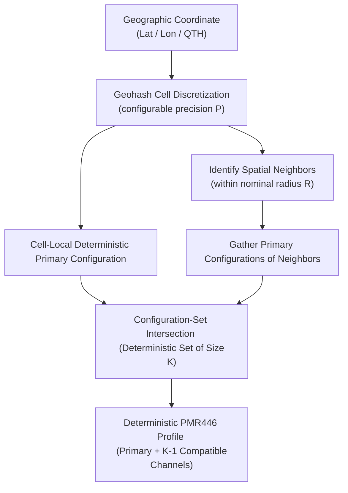

# PMR446 GeoConfig: Geographic Configuration Protocol for PMR446 Radios
## Technical Specification and Standardization Proposal
**Version:** 1.0.0  
**Status:** Proposal / Draft Standard  

---

## Abstract

This document outlines **PMR446 GeoConfig**, a decentralized, deterministic, and geographically aware configuration protocol for PMR446 (Private Mobile Radio, $446\text{ MHz}$) analog equipment. 

The protocol maps any physical coordinate on Earth to a stable, compatible set of channel and squelch tone combinations without relying on central registries, database lookups, or network synchronization. By combining Geohash spatial partitioning, Haversine geometry, and stable cryptographic hashing, PMR446 GeoConfig guarantees that any two adjacent users within a nominal $10\text{ km}$ communication radius share at least one common channel configuration, while geographically separated users automatically reuse configurations to minimize spectral congestion.

---

## 1. Introduction and Objectives

PMR446 is a license-free personal radio service used widely across Europe. However, because it operates on a limited set of shared frequencies, users frequently suffer from co-channel interference or find themselves unable to establish communication due to misaligned squelch settings. 

This standard addresses these challenges by introducing a decentralized spatial allocation protocol. The goals of **PMR446 GeoConfig** are:
1. **Determinism**: The same geographic inputs and protocol version must always yield identical configuration sets on any device or language.
2. **Infrastructure Independence**: No database, network service, or central registration is required.
3. **Compatibility**: Fully compatible with legacy analog PMR446 equipment using standard Continuous Tone-Coded Squelch System (CTCSS) tones.
4. **Spectral Reuse**: Efficient spatial packing allows distant cells to reuse frequencies while minimizing interference.



---

## 2. Mathematical Definition of Configuration Space

The analog PMR446 configuration space consists of two dimensions: RF frequency channel and CTCSS sub-audible tone.

### 2.1 Frequency Channels
Let $C$ be the set of standard PMR446 channels:
$$C = \{1, 2, 3, 4, 5, 6, 7, 8\}$$

The physical carrier frequencies corresponding to each channel number are defined in the following table (12.5 kHz spacing with 6.25 kHz channel boundary offset):

| Channel Number | Carrier Frequency (MHz) |
| :---: | :--- |
| **1** | 446.00625 |
| **2** | 446.01875 |
| **3** | 446.03125 |
| **4** | 446.04375 |
| **5** | 446.05625 |
| **6** | 446.06875 |
| **7** | 446.08125 |
| **8** | 446.09375 |

### 2.2 Squelch System (CTCSS)
Let $T$ be the ordered set of the 38 standard CTCSS tones represented in Hertz:
$$T = \Big( T_0, T_1, \ldots, T_{37} \Big)$$

The physical sub-audible tone frequencies and their corresponding mathematical indexes and common tone numbers are specified in the table below:

| Tone Number | Array Index ($i$) | Squelch Frequency (Hz) |
| :---: | :---: | :--- |
| **1** | 0 | 67.0 |
| **2** | 1 | 71.9 |
| **3** | 2 | 74.4 |
| **4** | 3 | 77.0 |
| **5** | 4 | 79.7 |
| **6** | 5 | 82.5 |
| **7** | 6 | 85.4 |
| **8** | 7 | 88.5 |
| **9** | 8 | 91.5 |
| **10** | 9 | 94.8 |
| **11** | 10 | 97.4 |
| **12** | 11 | 100.0 |
| **13** | 12 | 103.5 |
| **14** | 13 | 107.2 |
| **15** | 14 | 110.9 |
| **16** | 15 | 114.8 |
| **17** | 16 | 118.8 |
| **18** | 17 | 123.0 |
| **19** | 18 | 127.3 |
| **20** | 19 | 131.8 |
| **21** | 20 | 136.5 |
| **22** | 21 | 141.3 |
| **23** | 22 | 146.2 |
| **24** | 23 | 151.4 |
| **25** | 24 | 156.7 |
| **26** | 25 | 162.2 |
| **27** | 26 | 167.9 |
| **28** | 27 | 173.8 |
| **29** | 28 | 179.9 |
| **30** | 29 | 186.2 |
| **31** | 30 | 192.8 |
| **32** | 31 | 203.5 |
| **33** | 32 | 210.7 |
| **34** | 33 | 218.1 |
| **35** | 34 | 225.7 |
| **36** | 35 | 233.6 |
| **37** | 36 | 241.8 |
| **38** | 37 | 250.3 |

The length of the CTCSS set is:
$$|T| = 38$$

### 2.3 Configuration Space Mapping
The complete discrete configuration space $\mathcal{S}$ is the Cartesian product:
$$\mathcal{S} = C \times T \quad \text{where} \quad |\mathcal{S}| = 8 \times 38 = 304$$

Any configuration $s_i \in \mathcal{S}$ is represented as a tuple:
$$s = (\text{channel}, \text{ctcss\_tone})$$

To facilitate compact computation, storage, and index indexing, a bijective encoding function $f: C \times T \to \mathbb{Z}_{304}$ maps configurations to stable integer IDs:
$$f(c, t_i) = (c - 1) \times 38 + i$$

The decoding inverse function $f^{-1}: \mathbb{Z}_{304} \to C \times T$ is defined as:
$$f^{-1}(\text{id}) = \left( \lfloor \text{id} / 38 \rfloor + 1, \,\, T_{\text{id} \bmod 38} \right)$$

---

## 3. Geographic Modeling and Discretization

Physical space is discretized into discrete cells using Geohash, and distance geometry is modeled using the Haversine formula on a spherical earth.

### 3.1 Geohash Discretization
Geohash is a hierarchical spatial index that divides the Earth's surface into rectangular grid cells using binary interval partitioning. Coordinates are encoded into a Base32 string using the alphabet:
$$\Sigma_{\text{base32}} = \text{"0123456789bcdefghjkmnpqrstuvwxyz"}$$

The resolution of cells is determined by the geohash precision $P$ (the character length):
- $P=5$ (default): Cell dimension $\approx 4.9\text{ km} \times 4.9\text{ km}$ at the equator.
- $P=6$: Cell dimension $\approx 1.2\text{ km} \times 0.61\text{ km}$ at the equator.

### 3.2 Distance Metric
To preserve geometric accuracy over long ranges, the distance $d$ between two coordinates $(lat_1, lon_1)$ and $(lat_2, lon_2)$ is computed using the spherical **Haversine formula**:
$$a = \sin^2\left(\frac{lat_2 - lat_1}{2}\right) + \cos(lat_1)\cos(lat_2)\sin^2\left(\frac{lon_2 - lon_1}{2}\right)$$
$$c = 2 \arcsin(\sqrt{a})$$
$$d = R_{\text{earth}} \times c$$

Where the standard mean Earth radius is defined as:
$$R_{\text{earth}} = 6371.0088\text{ km}$$

---

## 4. Geographic Graph Modeling

To represent cell connectivity across any simulated region, the protocol models physical space as an undirected graph:
$$G = (V, E)$$

Where:
- $V \subset \mathcal{H}_P$: The set of active Geohash cells of precision $P$.
- $E$: The set of links connecting compatible cells:
  $$E = \{ (u, v) \in V \times V \mid d_{\text{haversine}}(\text{center}(u), \text{center}(v)) \le R_{\text{radio}} \}$$

Here, $\text{center}(u)$ returns the coordinate of the center of cell $u$, and $R_{\text{radio}}$ is the nominal communication radius (defaulting to $10.0\text{ km}$).

```
[Cell A] <=========== distance <= 10 km ===========> [Cell B]
   |                                                    |
   v                                                    v
Configuration Set A                                  Configuration Set B
{ CH3/77.0, CH7/67.0 }   --- Shared: CH7/67.0 ---    { CH5/88.5, CH7/67.0 }
```

---

## 5. The Compatibility Invariant and Protocol Rules

The core protocol requires that any two geographically compatible cells share at least one PMR446 configuration, guaranteeing that a radio link can always be established using the cell-local profile.

### 5.1 The Symmetric Standby-Calling Compatibility Invariant
To ensure that any operator can initiate contact with any standby neighbor cell $v$ within communication range, the protocol enforces that Cell $A$'s configuration set $\mathcal{C}(u)$ MUST list the Primary standby frequency of all its reachable neighbor cells:
$$(u, v) \in E \implies \text{Primary}(v) \in \mathcal{C}(u) \quad \text{and} \quad \text{Primary}(u) \in \mathcal{C}(v)$$

This mathematically guarantees that the old intersection invariant ($\mathcal{C}(u) \cap \mathcal{C}(v) \ne \emptyset$) is fully satisfied, while ensuring direct, two-way standby-calling compatibility.

### 5.2 Rule 1: No Transitive Propagation
To avoid a chain reaction where adjacent cells are forced to have identical standby configurations across long distances, **nearby cells do not share the same Primary configuration**.
$$\text{Primary}(u) \ne \text{Primary}(v) \quad \text{is mathematically guaranteed.}$$
Instead, mutual communication is established because each cell's set contains its neighbors' unique primary configurations:
$$\mathcal{C}(u) = \{ \text{Primary}(u) \} \cup \{ \text{Primary}(v) \mid (u, v) \in E \}$$

```
A (CH3/77.0) ------- B (CH5/88.5) ------- C (CH2/123.0)
|                     |                     |
| Distance <= 10 km   | Distance <= 10 km   | Distance > 10 km (No link)
v                     v                     v
C(A) ∩ C(B) != Ø      C(B) ∩ C(C) != Ø      C(A) ∩ C(C) can be empty (Ø)
(Transitive propagation avoided: Primary A does not equal Primary C)
```

### 5.3 Rule 2: Standby Monitoring Standard (The Golden Operating Rule)
To establish communication completely ad-hoc and without coordination, all compliant radio operators must observe the following dual-rule operating standards:

1. **The Standby (Monitoring) Rule**:
   Every active operator **MUST** set their receiver to monitor their local cell's **Primary Standby** configuration by default.
   $$\text{Active Receiver State}(u) = \text{Primary}(u)$$
   *Rationale:* This acts as a decentralized spatial "calling channel" or "inbox." Your squelch will remain quiet from noise, but any nearby operator can reach you by calling your cell's designated Primary frequency.

2. **The Outbound Calling Rule**:
   To contact an operator in a nearby cell $v$, you **MUST** temporarily tune your transmitter and receiver to **their** cell's **Primary** configuration, initiate the call, and wait for them to answer.
   $$\text{Transmitter State}(u \to v) = \text{Primary}(v)$$
   *Rationale:* Once contact is successfully established, the two operators can continue talking on $\text{Primary}(v)$, or they may agree to move ("QSY") to any other mutual configuration in their intersection set $\mathcal{C}(u) \cap \mathcal{C}(v)$ to free up the calling channel.

---

## 6. Reference Algorithms (Pseudocode)

This section provides the official, deterministic reference algorithms for compliant implementations.

### 6.1 Coordinate Discretization: Geohash Encoding

```text
Algorithm: EncodeGeohash
Input: latitude, longitude, precision
Output: geohash_string

Let BASE32 = "0123456789bcdefghjkmnpqrstuvwxyz"
Let lat_min = -90.0, lat_max = 90.0
Let lon_min = -180.0, lon_max = 180.0

Initialize geohash = []
Let total_bits = precision * 5
Initialize current_val = 0

For bit_idx from 0 to total_bits - 1:
    If bit_idx is even:
        Let mid = (lon_min + lon_max) / 2
        If longitude >= mid:
            current_val = (current_val << 1) | 1
            lon_min = mid
        Else:
            current_val = (current_val << 1) | 0
            lon_max = mid
    Else:
        Let mid = (lat_min + lat_max) / 2
        If latitude >= mid:
            current_val = (current_val << 1) | 1
            lat_min = mid
        Else:
            current_val = (current_val << 1) | 0
            lat_max = mid

    If (bit_idx + 1) mod 5 == 0:
        Append BASE32[current_val] to geohash
        current_val = 0

Return concatenate(geohash)
```

### 6.2 2D Coordinate-Based Modular Tessellation Grid
To assign a primary configuration ID to a cell without any external database, neighbor coordinates, or hashing overhead, compliant devices MUST map the Geohash cell to its 2D discrete grid indices and apply a modular shifting tessellation. This mathematically guarantees that no adjacent cells share the same primary configuration.

```text
Algorithm: GetPrimaryByTessellation
Input: geohash_str
Output: configuration_id (integer 0 to 303)

Let lat, lon, lat_err, lon_err = DecodeGeohash(geohash_str)
Let lat_height = 2.0 * lat_err
Let lon_width = 2.0 * lon_err

# Discretize geographic coordinates into stable discrete integer coordinates
Let Y = Round((lat + 90.0) / lat_height)
Let X = Round((lon + 180.0) / lon_width)

# Apply 2D modular shift pattern (multipliers: MX = 1, MY = 17)
Let color_id = (Y * 17 + X) mod 304
If color_id < 0:
    color_id = color_id + 304

Return color_id
```

---

### 6.3 Local Neighborhood Expansion
To allow a standalone radio device to build its configuration set $\mathcal{C}(u)$ of size $K$ without building a global regional graph, it resolves neighboring Geohash cells geometrically.

```text
Algorithm: ResolveLocalProfile
Input: lat, lon, precision, radius_km, K
Output: profile_dictionary

Let cell_geohash = EncodeGeohash(lat, lon, precision)
Let primary_id = GetPrimaryByTessellation(cell_geohash)

If K <= 1:
    Return { geohash: cell_geohash, primary: primary_id, configurations: [primary_id] }

# Determine bounding limits
Let lat_step = radius_km / 111.1
Let cos_lat = cos(radians(lat))
Let lon_step = lat_step / max(0.01, cos_lat)

# Decode cell errors to step grid
Let cell_lat, cell_lon, lat_err, lon_err = DecodeGeohash(cell_geohash)
Let step_lat_deg = 2.0 * lat_err
Let step_lon_deg = 2.0 * lon_err

Let lat_bound = ceiling(lat_step / step_lat_deg) + 1
Let lon_bound = ceiling(lon_step / step_lon_deg) + 1

Initialize neighbors = EmptySet()

For i from -lat_bound to lat_bound:
    For j from -lon_bound to lon_bound:
        Let test_lat = lat + i * step_lat_deg
        Let test_lon = lon + j * step_lon_deg
        
        Let gh = EncodeGeohash(test_lat, test_lon, precision)
        If gh != cell_geohash:
            Let gh_lat, gh_lon = CenterCoordinates(gh)
            Let dist = HaversineDistance(lat, lon, gh_lat, gh_lon)
            If dist <= radius_km:
                neighbors.add( (dist, gh) )

# Sort neighbors primarily by distance (ascending), secondarily by geohash (alphabetical)
Sort neighbors

Initialize allocated_configs = [primary_id]
Initialize seen_configs = {primary_id}

For each (dist, gh) in neighbors:
    If length(allocated_configs) >= K:
        Break
    Let neigh_primary = GetPrimaryByTessellation(gh)
    If neigh_primary not in seen_configs:
        Add neigh_primary to allocated_configs
        Add neigh_primary to seen_configs

Return {
    geohash: cell_geohash,
    primary: primary_id,
    configurations: allocated_configs
}
```

---

### 6.4 Alphabetical Greedy Graph Coloring (Global Simulator Variant)
For simulations or centralized optimization where a full graph is constructed, compliance testing may employ an alphabetical greedy coloring algorithm to assign primary configurations.

```text
Algorithm: AllocatePrimaryColoring
Input: nodes (set of geohashes), adjacency (map of node to neighbor set)
Output: primary_assignments (map of node to config_id)

Let sorted_nodes = SortAlphabetically(nodes)
Initialize primary_assignments = EmptyMap()

For each node in sorted_nodes:
    Let neighbor_colors = EmptySet()
    For each neighbor in adjacency[node]:
        If neighbor in primary_assignments:
            neighbor_colors.add(primary_assignments[neighbor])
            
    # Find smallest configuration ID not used by neighbors
    Let assigned_color = -1
    For color_id from 0 to 303:
        If color_id not in neighbor_colors:
            assigned_color = color_id
            Break
            
    If assigned_color == -1:
        # Fallback to local hash if neighbor degrees exceed 304 (extremely rare)
        assigned_color = GetPrimaryByTessellation(node)
        
    primary_assignments[node] = assigned_color

Return primary_assignments
```

---

## 7. Compliance and Verification Criteria

An implementation of PMR446 GeoConfig is considered fully compliant if it satisfies the following criteria:
1. **Bijective Invariant**: Config ID 0 maps to (CH1, CTCSS 67.0) and Config ID 303 maps to (CH8, CTCSS 250.3).
2. **Determinism Invariant**: Two runs of any reference algorithm on identical inputs MUST return identical configuration allocations.
3. **Local/Global Convergence**: Standalone profiles computed locally using `ResolveLocalProfile` must exactly match profiles computed from a globally bounded geographic graph.
4. **Compatibility Invariant**: For any two nodes $A$ and $B$, if $d(A, B) \le R_{\text{radio}}$, then their configuration sets MUST overlap ($\mathcal{C}(A) \cap \mathcal{C}(B) \ne \emptyset$) for the minimum compliant $K$.
